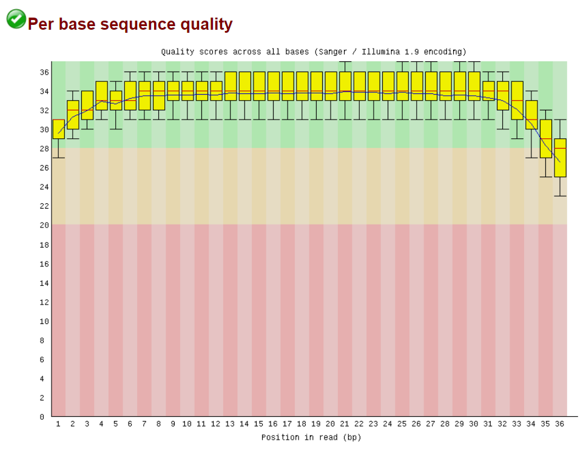

# hse_hw2_chip
В данном задании в качестве объекта исследования взята клеточная линия DND-41 и исследована метка H2AFZ.
## Google Colab
Ссылка на Google Colab ноутбук с кодом основного задания
[https://colab.research.google.com/drive/1q5N0OSBWzteZIzn9KlPh7kSApB1yDLZ2?usp=sharing](https://colab.research.google.com/drive/1q5N0OSBWzteZIzn9KlPh7kSApB1yDLZ2?usp=sharing) \
Ссылка на Colab с кодом бонусного задания
[https://colab.research.google.com/drive/1oDxIH7U7jCXgZWfrDsMk38xMsxviDfxb?usp=sharing](https://colab.research.google.com/drive/1oDxIH7U7jCXgZWfrDsMk38xMsxviDfxb?usp=sharing)
## FastQC
Анализ FastQC чтений лежит в папке report, соответственно ENCFF000APA_fastqc.html и ENCFF000APB_fastqc.html - наши реплики, ENCFF000AOG_fastqc.html - контроль. \
Анализ контроля ENCFF000AOG_fastqc.html никаких странностей не выявил, все характеристики в норме (см. рисунок). \
По полученным пикам были построены ngs plot и heatmap \
 \
В анализе ENCFF000APA наблюдается большое количество ридов с конкретной долей GC нуклеотидов (примерно 56%), возможно это свойство чтений, однако, так как качество чтений всё-равно хорошее, то фильтраций не было. \
 \
В анализе APB_fastqc из необычного, только наличие некоторых ридов, у которых в конкретной позиции в середине немного плохое качество секвенирования, но анализ не показывает данное состояние критическим, поэтому с этим образцом так же никаких дальнейших фильтраций не происходило. \
 \
## Выравнивание
Данные чтения выравнивались на первую хромосому.
|| ENCFF000APA | ENCFF000APB | ENCFF000AOG |
| --- | ---- | ---- | ---- |
| Ридов в файле | 23116944 | 34724396 | 41060673 |
| Выровнялось уникально | 1576535 (6.82%) | 2672158 (7.70%) | 3331953 (8.11%) |
| Выровнялось не уникально | 2864370 (12.39%) | 4877062 (14.05%) | 6977458 (16.99%) |
| Не выровнялось | 18676039 (80.79%) | 27175176 (78.26%) | 30751262 (74.89%) |

Как можно заметить, довольно много чтений ни разу не выровнялось, скорее всего это связано с тем, что мы картируем не на весь геном, а только на одну первую хромосому. Интересно, что первая хромосома занимает примерно 8% всего генома человека, и это примерно соотносится с количеством уникальных чтений. Также можно заметить большое число множественных выравниваний, возможно это какие-то повторяющиеся в нескольких местах последовательности, на которые садятся гистоны.

## Диаграммы Вена
Диаграммы Вена расположены в папке ./vene в виде pdf файлов. \
На них видно, что результаты полученные нами и результаты с сайта ENCODE 
отличаются. С одной стороны это можно объяснить тем, что мы картировали риды не на весь геном, а только на первую хромосому. Однако есть пики, которые присутствуют у нас, но их нет в оригинальной работу, возможно они появились из-за других настроек картирования и обработки пиков.

## Бонус
По пикам, полученным из базы данных ENCODE был построены ngs plot и heatmap для двух реплик\

 \
Как видно, наша метка H2AFZ в основном присутствует в промотере перед геном и на нуклеотидах сразу в начале рамки считывания, что соответствует её типичному расположению. Возможно это связано с тем, что метка H2AFZ отрицательно влияет на экспрессию генов. 
